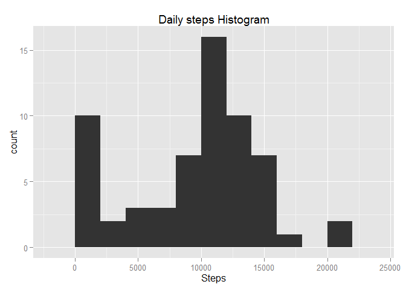
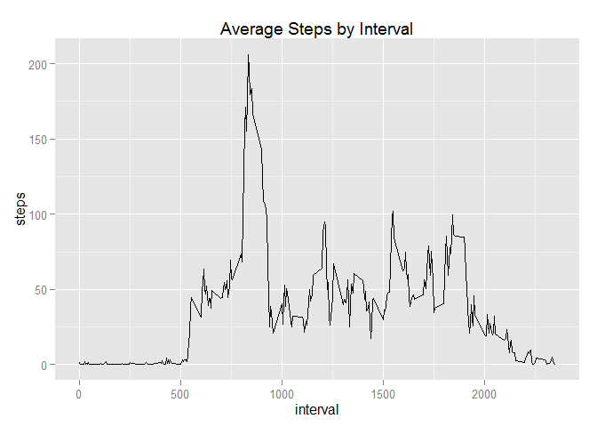
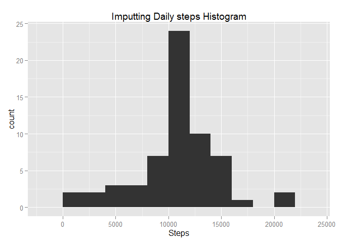
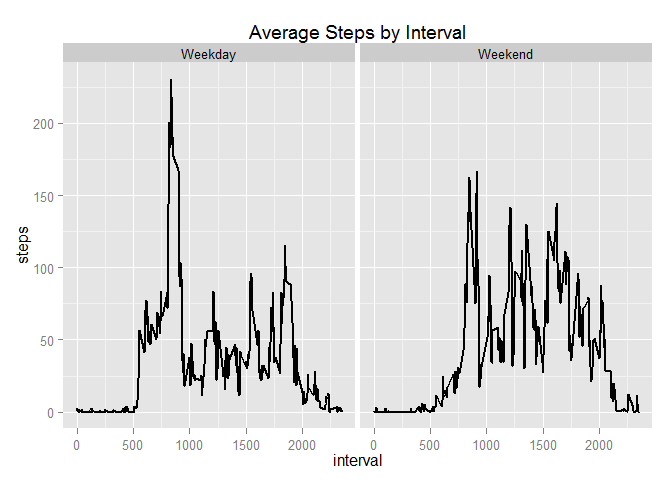

# Reproducible Research: Peer Assessment 1
## Data from a personal activity monitoring device

## Loading and preprocessing the data

```r
StepsActivity <-read.csv("activity.csv",stringsAsFactor=FALSE)
head(StepsActivity)
```

```
##   steps       date interval
## 1    NA 2012-10-01        0
## 2    NA 2012-10-01        5
## 3    NA 2012-10-01       10
## 4    NA 2012-10-01       15
## 5    NA 2012-10-01       20
## 6    NA 2012-10-01       25
```

```r
StepsActivity$date <- as.Date(StepsActivity$date)
library(ggplot2)
```
## What is mean total number of steps taken per day?

```r
StepsDay <- aggregate(x = StepsActivity$steps ,by = list(StepsActivity$date), FUN = sum ,na.rm=TRUE)
names(StepsDay) <- c("date","steps")
plot1 <- ggplot(StepsDay,aes(x = steps)) +
            ggtitle("Daily steps Histogram") +
            xlab("Steps") +
            geom_histogram(binwidth = 2000)

plot1
```

 

```r
#mean & median total number of steps taken per day
mean(StepsDay$steps , na.rm = TRUE)
```

```
## [1] 9354.23
```

```r
median(StepsDay$steps , na.rm = TRUE)
```

```
## [1] 10395
```
## What is the average daily activity pattern?

```r
StepsInterval  <- aggregate(x = StepsActivity$steps , by = list(StepsActivity$interval), FUN = mean ,na.rm=TRUE)
names(StepsInterval) <- c("interval","steps")

plot2 <- ggplot(StepsInterval,aes(interval,steps)) +
                 ggtitle("Average Steps by Interval") +
                 geom_line()

plot2
```

 

```r
StepsInterval[which.max(StepsInterval$steps),c("interval")]
```

```
## [1] 835
```
## Imputing missing values


```r
#imputing missing step values
StepsActivity.imputed <- merge(x = StepsActivity, y = StepsInterval, by = "interval", all.x = TRUE)
StepsActivity.imputed[is.na(StepsActivity.imputed$steps.x),c("steps.x")] <- StepsActivity.imputed[is.na(StepsActivity.imputed$steps.x),c("steps.y")]

#cleaning data
StepsActivity.imputed$date <- as.Date(StepsActivity.imputed$date)
StepsActivity.imputed$date.x <- NULL
StepsActivity.imputed$Group.1 <- NULL
StepsActivity.imputed$steps <- StepsActivity.imputed$steps.x
StepsActivity.imputed$steps.x <- NULL
StepsActivity.imputed$steps.y <- NULL

StepsDay <- aggregate(x = StepsActivity.imputed$steps , by = list(StepsActivity.imputed$date), FUN = sum ,na.rm=TRUE)
names(StepsDay) <- c("date","steps")
plot3 <- ggplot(StepsDay,aes(x = steps)) +
            ggtitle("Imputting Daily steps Histogram") +
            xlab("Steps") +
            geom_histogram(binwidth = 2000)

plot3
```

 
## Are there differences in activity patterns between weekdays and weekends?


```r
StepsActivity.imputed$weekday <- as.factor(ifelse(weekdays(StepsActivity.imputed$date) %in% c("Saturday","Sunday"), "Weekend", "Weekday")) 

IntervalWeekday  <- aggregate(x = StepsActivity.imputed$steps , 
                                                    by = list(StepsActivity.imputed$interval,StepsActivity.imputed$weekday), FUN = mean ,na.rm=TRUE)
names(IntervalWeekday) <- c("interval","weekday","steps")

plot4 <- ggplot(IntervalWeekday,aes(interval,steps)) +
                 ggtitle("Average Steps by Interval") +
                 facet_grid(. ~ weekday) +
                 geom_line(size = 1)

plot4
```

 
# End
